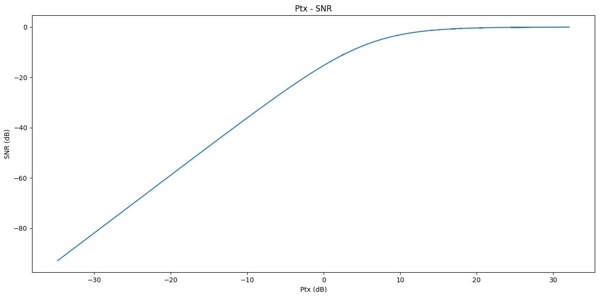
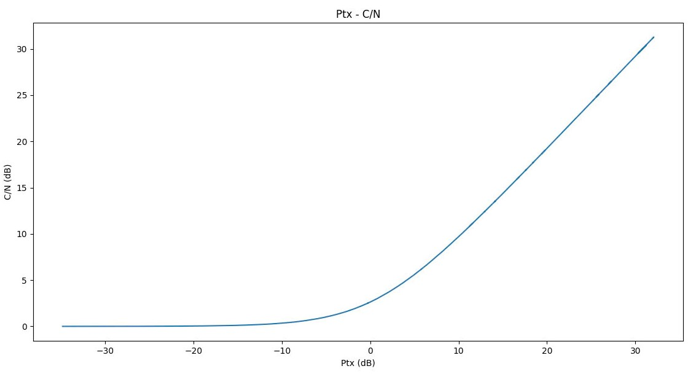

# group-11-satellite-uplink-20241
Satellite Uplink Simulation

# Satellite Uplink Simulation
<<<<<<< HEAD


=======


>>>>>>> 175b2011912040ed2046846173d80f3a5d71b35a

## Thông tin nhóm
- **Nhóm**: 11  
- **Mã lớp**: 154918  
- **Môn học**: Hệ thống viễn thông (ET4250)  
- **Học kỳ**: 20241  

## Tổng quan dự án
Đây là bài tập lớn trong môn học *Hệ thống viễn thông*. Dự án tập trung vào mô phỏng kênh truyền uplink trong hệ thống thông tin vệ tinh.  
Mục tiêu chính:
1. Mô hình hóa kênh truyền uplink của vệ tinh.  
2. Phân tích chất lượng tín hiệu và các thông số hiệu năng.  
3. Mô phỏng và đánh giá các yếu tố quan trọng.  

## Thành viên nhóm
- Thành viên 1: [Vũ Đức Hải](https://github.com/vuhai3903)
- Thành viên 2: [Nguyễn Quí Vượng](https://github.com/nqv96)
- Thành viên 3: [Trình Hữu Giang](https://github.com/TrinhHuuGiang)
- Thành viên 4: [Nguyễn Đăng Hải](https://github.com/haidang143)

## Cấu trúc repository
- `docs/`: Tài liệu và báo cáo.  
- `src/`: Mã nguồn và kịch bản mô phỏng.  
- `results/`: Kết quả mô phỏng và phân tích.  
- `README.md`: Mô tả dự án.  

## Cách chạy dự án
1. Clone repository về máy:
   ```bash
   git clone https://github.com/TrinhHuuGiang/group-11-satellite-uplink-20241.git

2. Chạy file mô phỏng:
Code điều chế và giải điều chế tín hiệu, kênh truyền Rician, tạp âm nhiệt:
– python z_Run_expect_script.py
Vẽ biểu đồ BER, SNR, C/N thay đổi khi thay đổi tần số sóng mang:
– python z_shift_fc.py
Vẽ biểu đồ BER, SNR, C/N thay đổi khi thay đổi công suất phát:
– python z_shift_Ptx.py