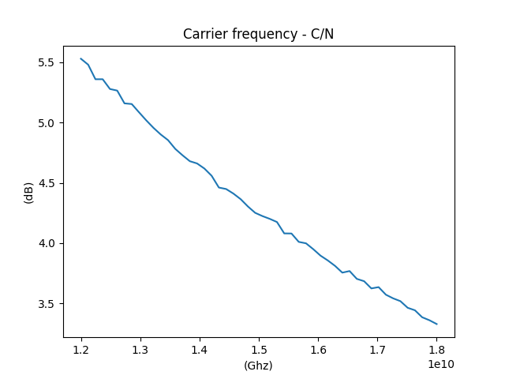

# group-11-satellite-uplink-20241
Satellite Uplink Simulation

## Group Information
- **Group**: SatComm 11  
- **Class Code**: 154918  
- **Course**: Telecommunication Systems (ET4250)
- **Semester**: 20241 - HUST  

## Project Overview
This is a major assignment for the *Telecommunication Systems* course. The project focuses on simulating the uplink channel in satellite communication systems.  
Key objectives:
1. Model the uplink channel of a satellite.  
2. Analyze signal quality and performance metrics.  
3. Simulate and evaluate key influencing factors.  

## Contributors
- Member 1: [Trinh Huu Giang](https://github.com/TrinhHuuGiang)  
- Member 2: [Nguyen Qui Vuong](https://github.com/nqv96)  
- Member 3: [Vu Duc Hai](https://github.com/vuhai3903)  

## Repository Structure
- `src/`: Source code and simulation scripts.  
- `results/`: Simulation results and analysis.  
- `README.md`: Project description.  

## How to Run the Project
1. Clone the repository to your local computer:  
   ```bash
   git clone https://github.com/TrinhHuuGiang/simulation-py-satellite-uplink.git

2. Run the simulation scripts:  
   Signal modulation/demodulation, Rician channel, thermal noise,...:  
   - python z_Run_expect_script.py  
   Plot BER, SNR, and C/N variation with carrier frequency:  
   - python z_shift_fc.py  
   Plot BER, SNR, and C/N variation with transmit power:  
   - python z_shift_Ptx.py

# Satellite Uplink Simulation




